# Splitee

A simple app for bill splitting. Made as an assignment for CareStack using Flutter, Typescript, and MongoDB.


## [📕 Frontend docs](https://github.com/RohitEdathil/Splitee/tree/master/sp_frontend#readme)

## [📗 Backend docs](https://github.com/RohitEdathil/Splitee/tree/master/sp_backend#readme)

## [📺 Demo video](https://youtu.be/83x_o12jnS0)

# Project Documentation

## Features

### Bills

- Create a bill and split it with anyone individually
- The creditor can edit and delete the bill
- Creditor can mark payment status of the bill
- Cost can be split equally or unequally, based on an amount or percentage

### Groups

- Anyone can create a group
- A user can join a group by scanning a QR code
- A user can leave a group, the associated bills will be migrated to individual bills
- The name of the group can be changed by the members
- All the features of bills are available in groups too, but the involved users are limited to the group members
- Pending payments are shown in the group page
- Balance of each user is also shown
- **Magic Split** - A feature that automatically redistributes the dues to minimize the number of transactions required to settle the bill

### User

- Anyone can create an account
- A user can edit their name and email

## Magic Split

This algorithm uses a greedy approach to minimize the number of transactions required to settle the bill. Uses a min-heap and a max-heap to keep track of the users with maximum credit and maximum debit.

- Calculates the total credit and debit of each user
- Finds the person with the maximum credit and the person with the maximum debit
- They both are paired and the minimum of the two is subtracted from the credit and debit of both
- This process is repeated until all the credits and debits are zero

## Demo

The demo is deployed on Render, and the database is hosted on MongoDB Atlas.

The app can be downloaded from the link below

### **[Download Splitee](https://github.com/RohitEdathil/Splitee/releases/download/v1.0/app-arm64-v8a-release.apk)**

The app in the link above is built for arm64-v8a architecture (works for most cases). If you are using another architecture, you can find a build for your architecture in the releases section.

**⚠️Note: The app is hosted on a free tier of Render, so it may take a few seconds to load the first time you open it due to [❄️Cold Start](<https://en.wikipedia.org/wiki/Cold_start_(computing)>)**

For exploring the app, you can use the following credentials

```
User-id: rtvrtvrtv
Password: qwerty
```

## Gallery
<span>
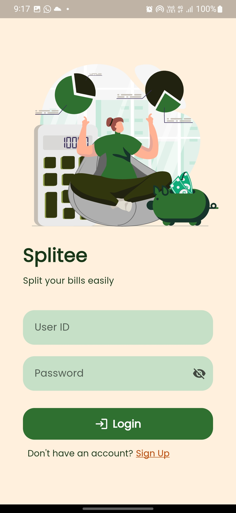
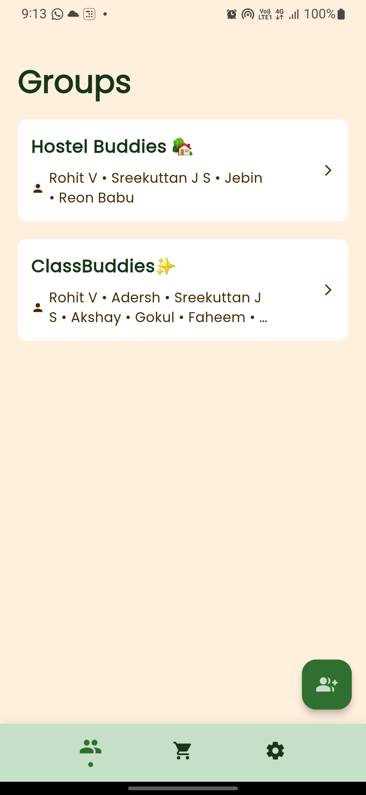
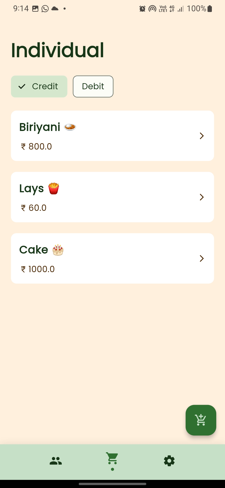
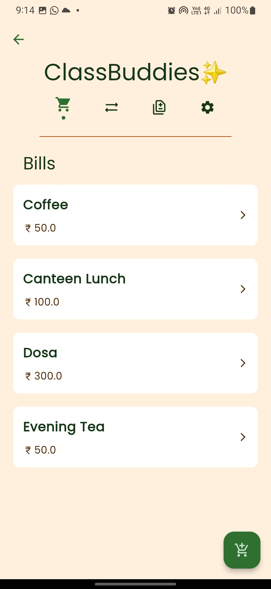
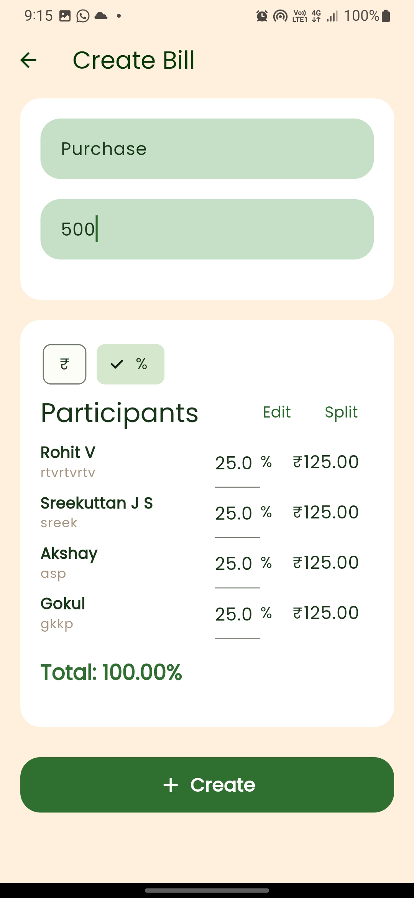
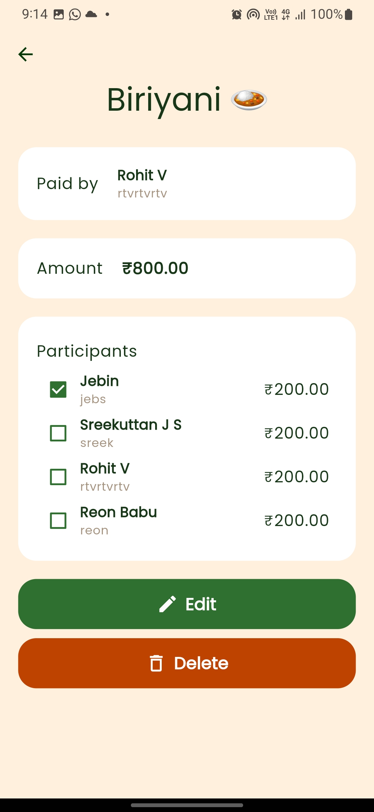
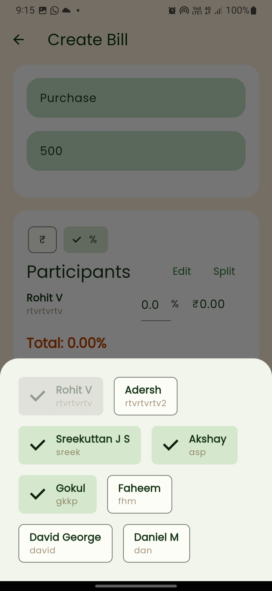
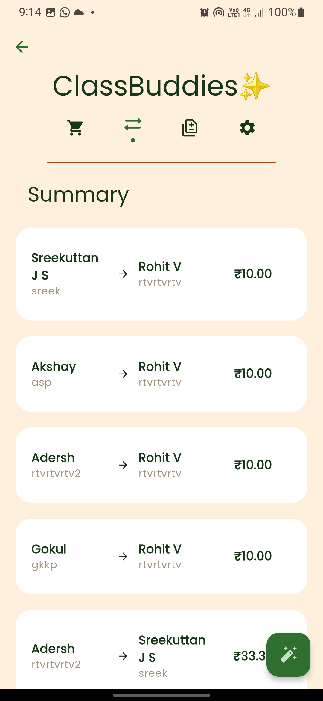
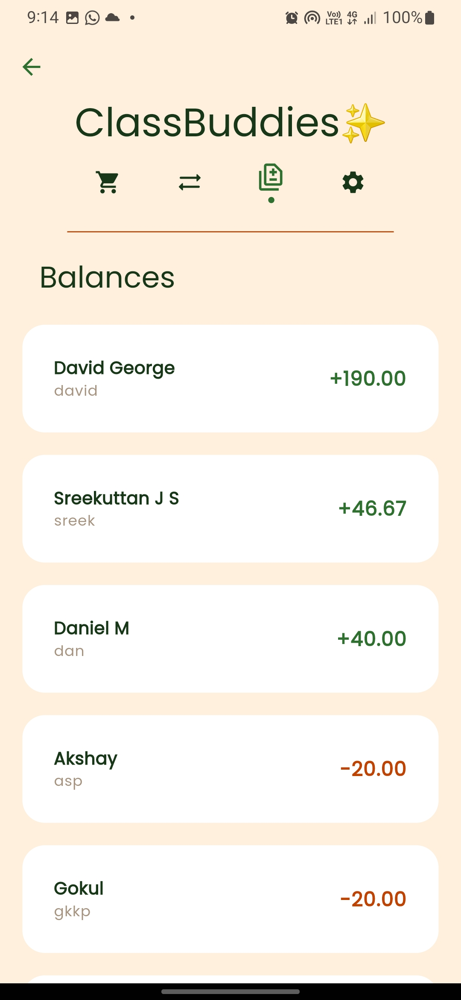
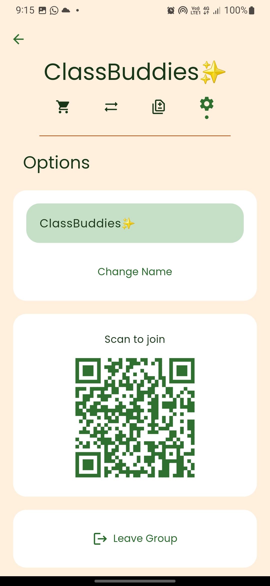
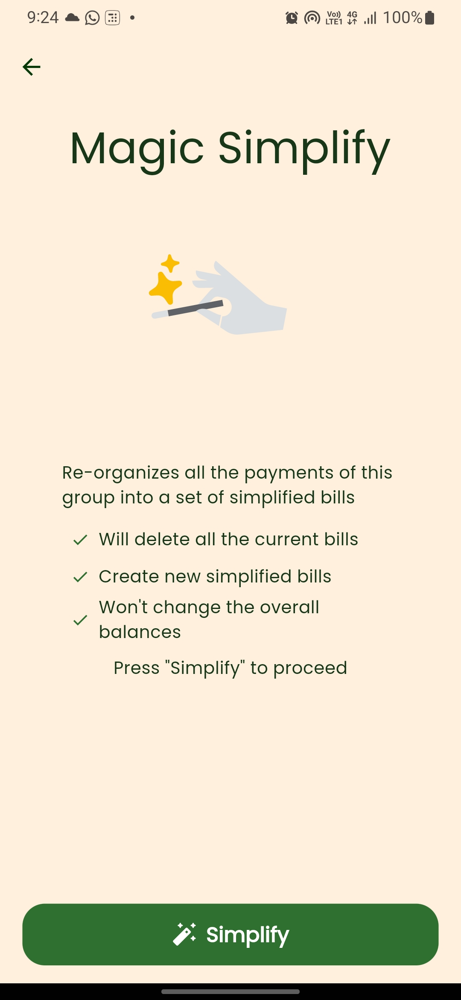
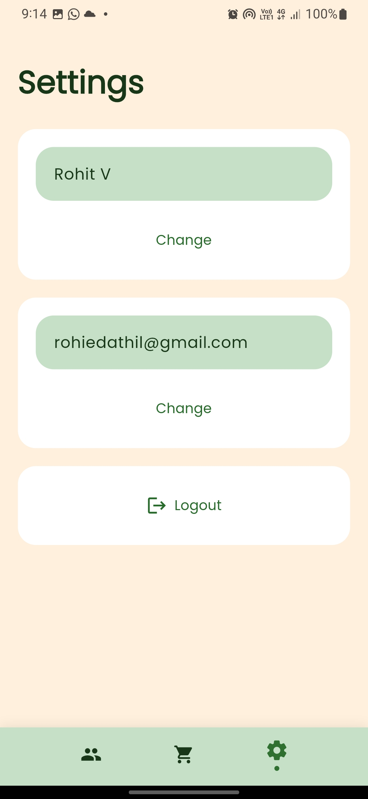
</span>
